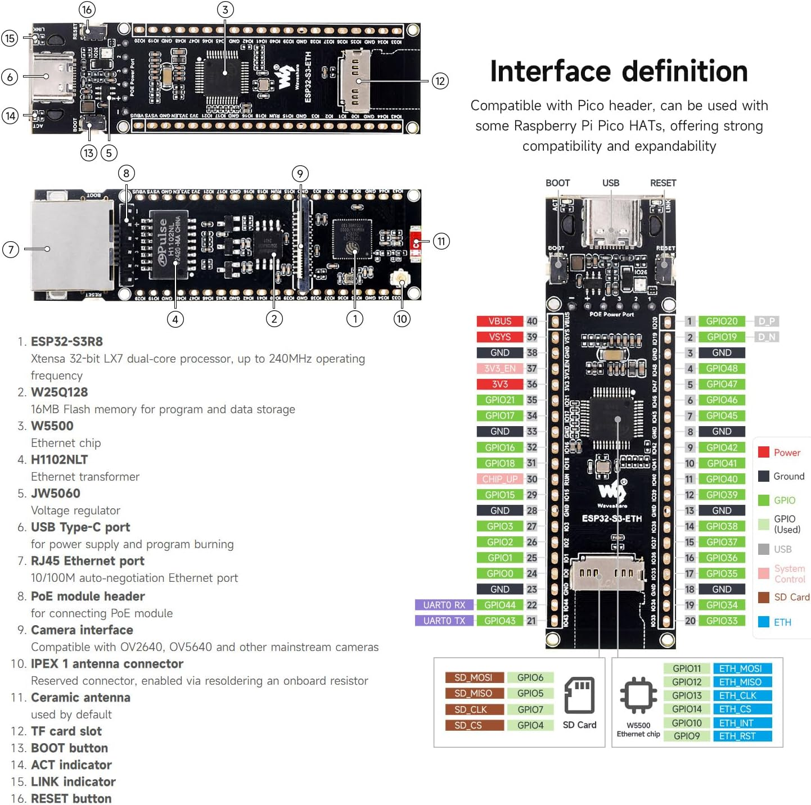

# TempNode

> Ethernet-first DS18B20 telemetry node for **Waveshare ESP32-S3-ETH** (ESP32-S3 + W5500).


TempNode reads DS18B20 sensors, exposes REST endpoints, publishes MQTT telemetry, writes history/logs to SD, and supports guarded OTA updates.

## Contents

- [Live API Docs](#live-api-docs)
- [Hardware](#hardware)
- [Quick Start](#quick-start)
- [Configuration](#configuration)
- [REST API](#rest-api)
- [MQTT API](#mqtt-api)
- [OTA Update](#ota-update)
- [Persistence and Logging](#persistence-and-logging)
- [Development](#development)
- [Troubleshooting](#troubleshooting)

## Live API Docs

GitHub Pages publishes both API documentations:

- REST (ReDoc): [dkennerknecht.github.io/TempNode](https://dkennerknecht.github.io/TempNode/)
- MQTT (AsyncAPI HTML): [dkennerknecht.github.io/TempNode/mqtt](https://dkennerknecht.github.io/TempNode/mqtt/)

Published specs:

- OpenAPI JSON: [openapi.json](https://dkennerknecht.github.io/TempNode/openapi.json)
- AsyncAPI YAML: [asyncapi.yaml](https://dkennerknecht.github.io/TempNode/asyncapi.yaml)

Repository specs:

- [`docs/openapi.json`](docs/openapi.json)
- [`docs/asyncapi.yaml`](docs/asyncapi.yaml)

## Hardware

### Target Board

- Waveshare ESP32-S3-ETH
- W5500 Ethernet via SPI
- TF/SD slot via SPI
- DS18B20 on 1-Wire

### Pin Mapping

| Function | Pin |
|---|---|
| ETH MISO | GPIO12 |
| ETH MOSI | GPIO11 |
| ETH SCLK | GPIO13 |
| ETH CS | GPIO14 |
| ETH RST | GPIO9 |
| ETH INT | GPIO10 |
| SD CS | GPIO4 |
| SD MOSI | GPIO6 |
| SD MISO | GPIO5 |
| SD SCK | GPIO7 |
| 1-Wire Data (DS18B20) | GPIO17 |
| RGB LED off-at-boot pins | GPIO21 / GPIO38 |

### Board Reference



## Quick Start

### 1. Prerequisites

- PlatformIO Core (`pio`)
- USB connection to board
- Optional: SD card (FAT32)
- Optional: MQTT broker

### 2. Configure Device

Copy and adjust config for filesystem upload:

```bash
cp config.example.json data/config.json
```

### 3. Build

```bash
pio run -e esp32s3
```

### 4. Flash Firmware + LittleFS + Monitor

```bash
pio run -e esp32s3 -t upload -t uploadfs -t monitor
```

This command uploads:

- Firmware image
- `data/` as LittleFS image (including `data/config.json`)
- Serial monitor

### 5. Verify

- Watch serial log for `ETH got IP: ...`
- Open `http://<node-ip>/api/v1/health`

## Configuration

Runtime config path is `/config.json`.

Config schema version:

- Top-level `configVersion` is used for migration (`2` = current)
- Older configs are auto-migrated on boot and written back to storage

Load order:

1. LittleFS `/config.json` (from `data/config.json` + `uploadfs`)
2. SD `/config.json` (optional override)

Main config blocks:

- `network`: hostname, DHCP/static IP fields
- `sensors`: interval, DS18B20 resolution, conversion timeout
- `rest`: enable + port
- `mqtt`: host/port/auth/topic/reconnect/offline buffering/health publishing
- `history`: path, flush interval, retention days
- `logging`: separate `consoleLevel` and `sdLevel`, rotation, retention
- `metrics`: enable `/api/v1/metrics`
- `watchdog`: task watchdog behavior
- `security`: REST auth mode + token policy
- `ota`: OTA gating and validation

Reference file:

- [`config.example.json`](config.example.json)

## REST API

Base URL:

- `http://<NODE_IP>/api/v1`

REST auth is controlled by `security.restAuthMode`:

- `anonymous`: no auth required
- `token`: Bearer token required

Optional behavior in token mode:

- `security.allowAnonymousGet=true` allows unauthenticated `GET` requests
- non-GET requests still require `Authorization: Bearer <token>`
- legacy `security.enabled` is still accepted; `restAuthMode` is preferred

`/api/v1/config` is always strict:

- requires `restAuthMode="token"` and valid Bearer token
- supports `PUT` patch with `dryRun` and `restart` flags

### Key Endpoints

| Method | Path | Purpose |
|---|---|---|
| GET | `/health` | Detailed status with subsystem checks |
| GET | `/temps` | Latest reading for all discovered sensors |
| GET | `/sensors` | Sensor summary and interval |
| GET/POST/PUT | `/sensors/interval` | Read/set sensor interval (persisted to LittleFS, mirrored to SD when `/config.json` exists) |
| GET | `/system` | Runtime diagnostics |
| GET | `/metrics` | Runtime + persisted counters |
| GET | `/history` | Tail history (`sensor`, `limit`) |
| GET/PUT | `/config` | Secure config read/patch (`dryRun`, optional restart) |
| POST | `/ota` | OTA upload endpoint (if enabled) |

### `/health` details

`checks.sd` includes:

- `sdMountFails`
- `sdWriteFails`
- `diskSizeBytes`
- `diskUsedBytes`
- `diskFreeBytes`
- `usagePercent`

`checks.mqtt` includes diagnostics such as:

- `host`, `port`, `user`
- `connectAttempts`
- DNS resolve result/IP
- ping result/latency
- TCP probe result

## MQTT API

Topic base defaults to `device`:

- `device/<deviceId>/temps/<sensorId>`
- `device/<deviceId>/system`
- `device/<deviceId>/health`
- `device/<deviceId>/status` (LWT retained)

Auth behavior:

- If `mqtt.user` and `mqtt.pass` are set: username/password login
- If both are empty: anonymous login
- Legacy fallback from `security.mqttUser` / `security.mqttPass` is still supported

Health metrics publishing:

- `mqtt.publishHealth` enables/disables health topic publishing
- `mqtt.healthIntervalMs` controls publish interval

Persistent offline queue on SD:

- `mqtt.offlinePersistSdEnabled`
- `mqtt.offlinePersistPath` (for example `/mqtt_offline.jsonl`)
- `mqtt.offlinePersistMaxLines`
- When enabled, disconnected sensor messages are persisted on SD and flushed after reconnect

Contract reference:

- [`docs/asyncapi.yaml`](docs/asyncapi.yaml)

## OTA Update

OTA endpoint is active only when all conditions are met:

- `ota.enabled=true`
- `ota.allowInsecureHttp=true`
- `security.restAuthMode="token"`
- `security.restToken` is set

Available endpoints:

- `POST /api/v1/ota` for firmware image uploads
- `POST /api/v1/ota/fs` for LittleFS image uploads

Validation includes:

- Bearer token check
- `.bin` filename
- `Content-Length`
- partition size fit
- hash check (`X-OTA-SHA256` recommended, `X-OTA-MD5` supported)
- version gate (if `ota.allowDowngrade=false`)

Build artifacts for OTA testing:

- Firmware image: `.pio/build/esp32s3/firmware.bin` (`pio run -e esp32s3`)
- LittleFS image: `.pio/build/esp32s3/littlefs.bin` (`pio run -e esp32s3 -t buildfs`)

## Persistence and Logging

Typical SD files:

- `/config.json` (optional override)
- `/history.jsonl`
- `/stats.json`
- `/log-YYYYMMDD.log` (daily rotation) or `/log.log`

History retention:

- `history.flushIntervalMs`
- `history.retentionDays`

Logging retention:

- `logging.consoleLevel` and `logging.sdLevel` can differ
- `logging.sdEnabled`
- `logging.rotateDaily`
- `logging.retentionDays`

## Development

### Common Commands

```bash
# Build
pio run -e esp32s3

# Flash firmware + LittleFS
pio run -e esp32s3 -t upload -t uploadfs

# Monitor
pio device monitor

# OpenAPI contract test
python3 scripts/contract_test_openapi.py

# Build local static docs (ReDoc + AsyncAPI HTML)
./scripts/build_api_docs.sh
```

### Key Files

- [`src/main.cpp`](src/main.cpp) - boot sequence and runtime wiring
- [`src/RestServer.cpp`](src/RestServer.cpp) - REST routes + OTA handler
- [`src/MqttClientManager.cpp`](src/MqttClientManager.cpp) - MQTT connect/reconnect/publish
- [`src/ConfigManager.cpp`](src/ConfigManager.cpp) - config loading + validation
- [`scripts/build_api_docs.sh`](scripts/build_api_docs.sh) - API docs generation
- [`.github/workflows/api-docs-pages.yml`](.github/workflows/api-docs-pages.yml) - GitHub Pages pipeline

## Troubleshooting

### MQTT connects to old/wrong host

Most common reason: runtime config on LittleFS/SD still has old values.

1. Update `data/config.json`
2. Re-upload LittleFS: `pio run -e esp32s3 -t uploadfs`
3. Reboot and re-check `/api/v1/health` -> `checks.mqtt.host`

### Build fails with missing library headers

Run clean build and ensure dependencies are installed:

```bash
pio run -t clean
pio run -e esp32s3
```

### `/health` returns `degraded`

Check fields in `checks.*` (network, mqtt, sd, time, ota_state). The response is intentionally detailed to show the failing subsystem.

---

No license file is currently included. Add a `LICENSE` file before public distribution.
